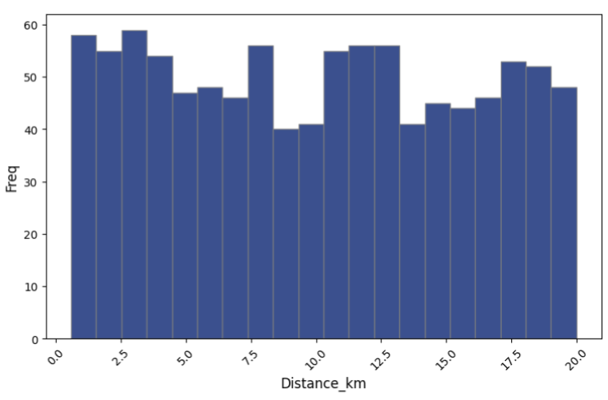
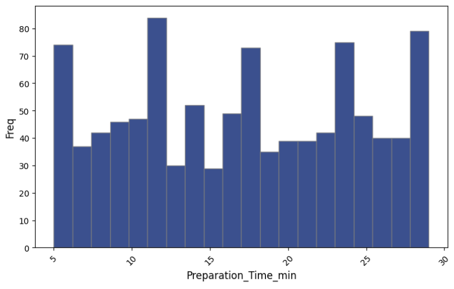
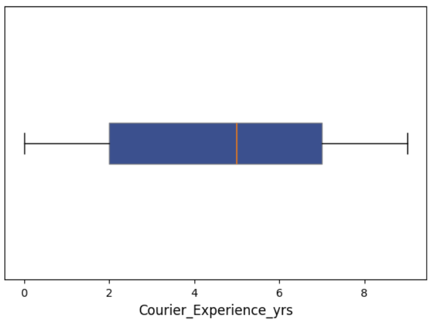
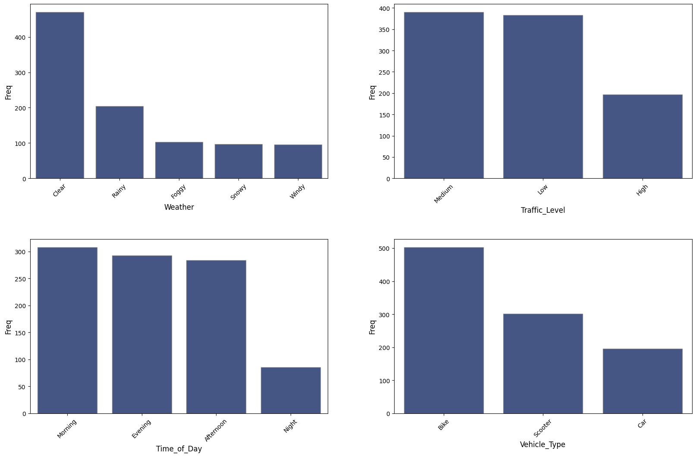
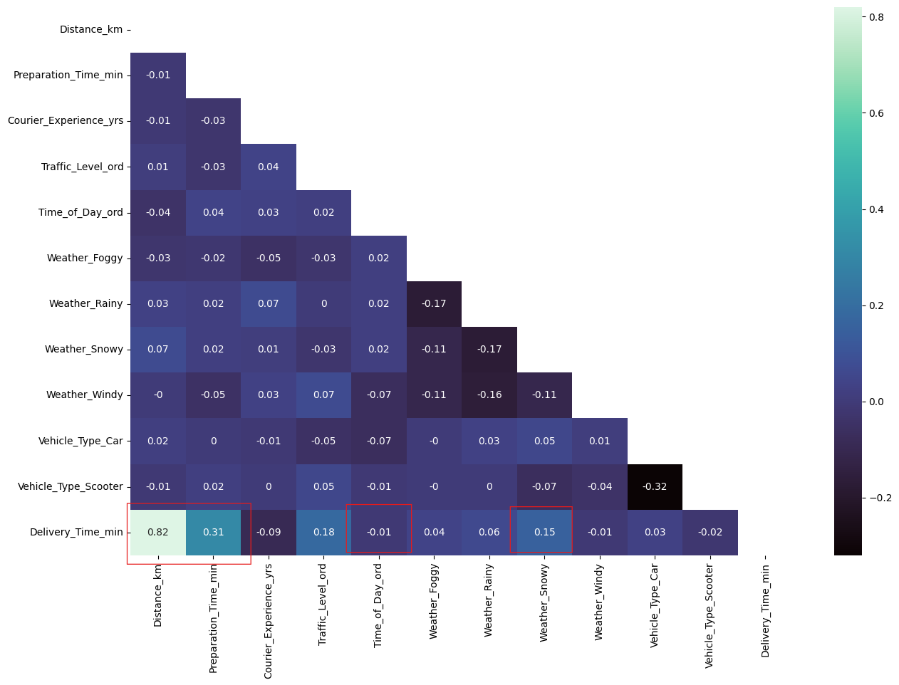
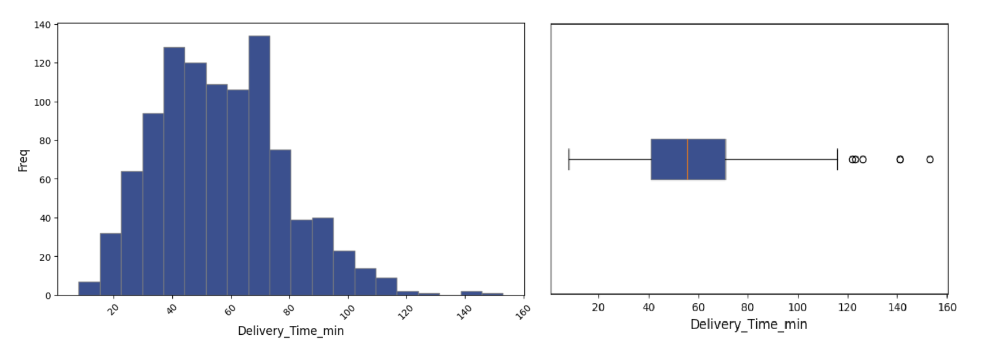

# Exploratory Data Analysis

**Dataset:** `data/Food_Delivery_Times.csv`  
**Author:** Ana Elizabeth Barrientos  
**Date:** June 2025

## 1. Data Overview
- **Dimensions:**
    - rows: 1000
    - columns: 9

- **Features:** as part of the pre-processing and EDA stages, it is essential to distinguish between variables
    - Order ID: nominal
    - Distance_km: continuous
    - Weather: nominal
    - Traffic_Level: ordinal
    - Time_of_Day: ordinal
    - Vehicle_Type: nominal
    - Preparation_Time_min: discrete (since it's whole numbers)
    - Courier_Experience_yrs: discrete (since it's whole numbers)
    - Delivery_Time_min: discrete (since it's whole numbers)

- **Missing Values:** the variables `Weather`, `Traffic_Level`, `Time_of_Day` and `Courier_Experience_yrs` report missing values. Each one has 30 NAs scattered around in different rows, meaning that approximately 3% of the data is missing for each of these features. If missing values are dropped, the data would lose around 9% of its information. The feature `Courier_Experience_yrs` also have NAs.

- **Note:** `order_id` will be dropped, since it does not provide a relevant value for the analysis.

## 2. Key Patterns

- **Numerical data:** 
    - By obtaining the descriptive statistics of the numerical variables, simple yet noticeable patterns emerge. For example, not all employees report years of experience; the maximum value for delivery time is excessively high (around 2.6 hours), and the highest distance to deliver an order is approximately 20 km, suggesting a possible error. 

        | Feature                  | count  |   mean   |    std    |   min  |   25%   |   50%   |    75%    |   max   |
        |--------------------------|--------|----------|-----------|--------|---------|---------|-----------|---------|
        | Distance_km              | 1 000  | 10.05997 |  5.69666  |   0.59 |   5.105 |  10.190 |  15.0175  |  19.990 |
        | Preparation_Time_min     | 1 000  | 16.98200 |  7.20455  |   5.00 |  11.000 |  17.000 |  23.0000  |  29.000 |
        | Courier_Experience_yrs   |   970  |  4.57938 |  2.91439  |   0.00 |   2.000 |   5.000 |   7.0000  |   9.000 |
        | Delivery_Time_min        | 1 000  | 56.73200 | 22.07092  |   8.00 |  41.000 |  55.500 |  71.0000  | 153.000 |

    - The features distance, preparation time and experience of employees have a relatively high variability

    
    
    

- **Categorical data:**
    - The most common weather condition is Clear. Foggy, Snowy, and Windy have about the same number of recurrences. If this feature has a weak association with delivery time, it is advised to encode the variable into three categories instead of five.
    - The most common traffic levels are medium and low. Interestingly enough, a high level of traffic was least reported.
    - The preferred means of transportation is a bike, as opposed to a car, which is less commonly used.

        

- **Correlation Matrix:**
    - Distance_km - Delivery_Time_min: a very strong monotonic relationship (0.82). As distance grows, delivery time consistently increases.
    - Preparation_Time_min - Delivery_Time_min: moderate positive rank‐correlation (0.31). Orders that take longer to prepare almost always rank higher in delivery time, not strangely enough.
    - Weather_Snowy - Delivery_Time_min: snowy conditions reliably rank above “no snow” in slowing down deliveries.
    - Traffic_Level_ord - Delivery_Time_min: small but clear monotonic effect. Heavier traffic tends to increase wait times.
    - Time_of_Day_ord - Delivery_Time_min: no trend across the time of the day to deliver.

        

## 3. Outliers
The Histogram of delivery time (target variable) is skewed to the right, confirming the presence of outliers. The box plot displays this more clearly. There are unusual times (above 120 mins), indicating isolated events. Best to remove them. 

## 4. Assumptions
- For the time of day variable, it will be assumed that the "distance" between Morning - Afternoon is the same as Evening - Night, which may not reflect reality. The best would be to work with timestamps.
- The data points with delivery times above 119 minutes will be treated as outliers. They will be assumed to be isolated events, which do not reflect the "normal" functioning of the operation.
- Given the high association between variables, such as such asaration time and andvery time, the first model to be tested is Linealinear regression this, it was assumed: 
    - There is a linear relationship between the independent variables and the dependent variable.
    - The error for one observation is not correlated with the error for any other observation.
    - The independent variables are not highly correlated with each other.
- The variables are measured accurately and without significant error.
- The number of data points is sufficient to depict the entire operation of the Food Delivery Company. The set spans typical operating conditions (no major seasonal, promotional, or holiday effects).  
- The measure of distance was done so it accurately depicts the actual travel distance. 