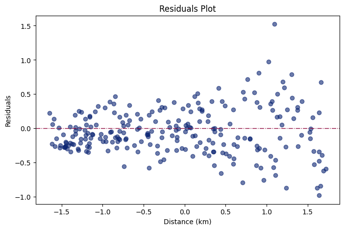
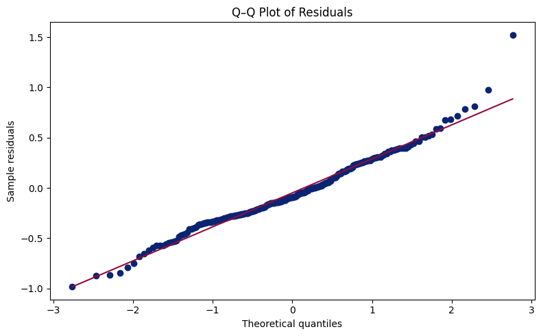

# Error Insights

## 1. Linear Regression
By examining the residuals plot, it is possible to notice a slightly funnel-shaped pattern for distances greater than 0.5, suggesting a very low extent of heteroscedasticity. This means that for high delivery times, the model introduces bias, and residuals or errors get a higher magnitude. A possible solution could be to transform the variables, e.g., $log(var)$. 

Another tool for assessing the limitations of linear regression is to plot a Q-Q plot, which compares the quantiles of the residuals against the quantiles of a perfect normal distribution. Between -1 and 1, most of the residuals fall on the line, meaning that errors follow a Gaussian distribution, approximately. Nevertheless, the tails exhibit deviations. They seem slightly off the line. In general, this means that for extreme delivery times (both low and high), the model falls short in making accurate predictions. 

## 2. Random Forest and XGBoost
If the data set had more noise and fewer observations, Random Forest would fail, as it would partition the noise, and averaging may not sufficiently smooth it out, leading to poor generalization. In addition, if more outliers were introduced to the set, the algorithm would map to the nearest seen leaf, yielding flat, biased predictions. Another significant effect in Random Forest and XGBoost is the Handling of Sparse Data. The performance of the tree ensembles would be degraded since the splits might become less meaningful given the high proportion of zeros.
When the underlying relationship between the predictors and outcome variable is simple and linear, Random Forest tends to show slightly worse performance, which is observed in this problem. Linear Regression metrics performed better than those of Random Forest and XGBoost. Even though the tree-ensemble can model linear relationships, they do so by approximating them with a series of step functions; so, using complex ensembles in this scenario was overkill.

### 2.1. Mitigation Strategies

| Challenge                     | RF Mitigation                        | XGBoost Mitigation                         |
|-------------------------------|--------------------------------------|--------------------------------------------|
| Overfitting on noise          | Limit `max_depth`, increase `min_samples_leaf` | Use `early_stopping_rounds`, regularization (`reg_alpha`/`reg_lambda`) |
| Extrapolation                 | Feature clipping, bounded inputs     | Input transformations, domain constraints |
| High dimensional sparsity     | Feature selection, dimensionality reduction | Column sampling (`colsample_bytree`)      |