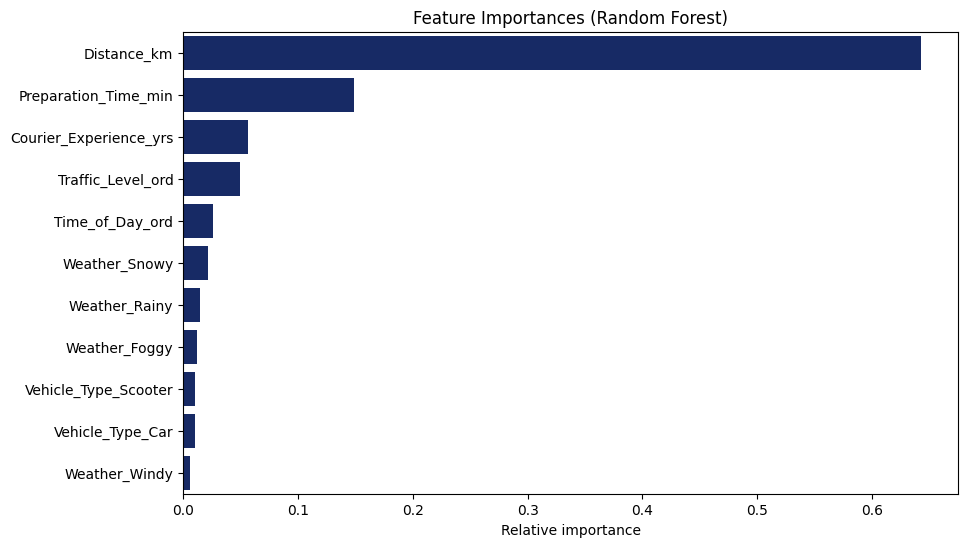

# Explainability Report

This section presents insights derived from feature‐importance techniques applied to the dataset. 

## Random Forest Feature Importance
Although the correlation matrix already provided hints about strong relationships amongst variables, the importance of each feature was determined by Random Forest. The model calculates the average reduction in variance contributed by each feature across all the trees in the forest. A feature that causes a larger average reduction is considered more important (Gemini). A randomized search was implemented to choose the best parameters because it is much faster and more efficient than Grid Search.

Extracted from the fitted `RandomForestRegressor`’s `feature_importances_`:

| Feature                  | Importance (RF) |
|--------------------------|----------------:|
| Distance_km              |           0.642 |
| Preparation_Time_min     |           0.148 |
| Courier_Experience_yrs   |           0.057 |
| Traffic_Level_ord        |           0.049 |
| Time_of_Day_ord          |           0.026 |
| Weather_Snowy            |           0.021 |
| Weather_Rainy            |           0.015 |
| Weather_Foggy            |           0.012 |
| Vehicle_Type_Scooter     |           0.011 |
| Vehicle_Type_Car         |           0.010 |
| Weather_Windy            |           0.006 |

- **Key Insights**
    - **Distance** is by far the primary driver of delivery time.  
    - **Preparation Time** adds significant delay, with diminishing returns.  
    - **Courier experience** represent the next most important factors.  
    - **Other features** have a low impact.