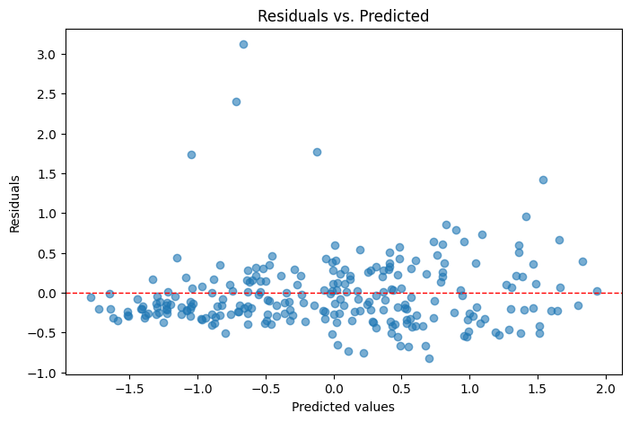

# Model Notes

This section summarizes the modeling logic, choice of evaluation metrics, and hyperparameter tuning approach used in the Food Delivery Time Prediction project.

## 1. Modeling Logic

### 1.1 Data Preparation
- **Imputation:**
    - `Weather`, `Traffic_Level`, and `Time_of_Day` have missing values, which means that approximately 3% of the data is missing for each of these features. Since the dataset is relatively small, it is better to impute missing values rather than discard them. The chosen method to fill NAs was Mode Imputation, which preserves the distribution shape, and its impact is minimal, given the 3% missing values.
    - `Courier_Experience_yrs` also has missing values; these were imputed with the median, since the distribution of the variable is not normal. Therefore, the median was used instead of the mean.

- **Encoding of variables:**
    - Nominal variables were encoded using Dummy Encoding. This method was preferred over One-Hot Encoding, as Dummy encoding drops one of the coordinates, thereby avoiding multicollinearity
    - For ordinal features `Traffic_Level` and `Time_of_Day`, it was first necessary to order the classes, and then each one was assigned a number (1, 2, 3, etc.). For example:
        ```
        traffic_ord = ["Low", "Medium", "High"]
        ```

- **Scaling:**
The decision to scale the data depends on the type of model being used. In this case, two types of models were considered: a distance-based model (Linear Regression), and tree-based methods, such as Random Forest and XGBoost. Although the tree-based methods do not rely on distance, the data were scaled using the z-score method for the linear regression model. A function was created to standardize the data:

    ```
    def standardization(df, col):
        """
    Computes the z-score standardization with mean = 0 and std = 1

    Args:
    df: dataset
    col: features to standardize 
        
    Returns
    new columns with standardize values
    """
        ave = df[col].mean()
        std = df[col].std()

        df[f'{col}_std'] = df[col].apply(lambda x: (x-ave)/std)
        return df
    ```

- **Anomaly detection:**
First, a ($k=3$) was used. For a range of three standard deviations around the mean, Chebyshev's theorem states that at least 89% of the observations fall within that range. In this case, 99.5% of the data falls within three standard deviations, indicating that the data does not exhibit a significant number of abnormalities; therefore, the values outside the 99.5% range were dropped. However, after fitting a first linear regression model, a residuals plot revealed that there were more outliers; so a ($k=2$) was preferredpreferred. Similarly, over 89% of the data was within two standard deviations (96.5%), so the values ​​were confidently discarded.
    

### 1.2 Feature Selection and Splitting of data
- Given that the correlation matrix hinted at the features with high association with the target variable, in addition to the feature importance results (further explained in the explainability report), which demonstrated that five variables out of nine explained approximately 90% of the total variance, it was decided that only the following variables would be worked with: ``` ["Distance_km" "Preparation_Time_min", "Courier_Experience_yrs", "Traffic_Level_ord", "Delivery_Time_min"]```
- **Proportion of testing set:** 0.25

### 1.3 Model Selection
- **Linear Regression:** A linear regression was selected as the first model due to the strong relationship between the features described above, especially `Distance_km`. The Spearman's correlation coefficient showed a powerful monotonic relationship (r = 0.82) with delivery time. Pearson's coefficient was also calculated, with a value around 0.70, indicating a significant linear relationship. This fact was decisive in selecting the linear model.

- **Random Forest, XGBoost:** Tree-based models were implemented since they capture non-linearities and interactions automatically. They are robust concerning outliers and are non-parametric models, which means they do not assume an underlying distribution for the dataset. Besides, these models are insensitive to the scale of features. Another advantage is that tree models can perform feature selection. Features that are more important for making splits and reducing impurity or error will naturally be ranked higher in terms of importance.

## 2. Hyperparameter Tuning
To select the optimal parameters for the Random Forest and XGBoost models, automated hyperparameter tuning methods were employed. The two most popular and effective ones are Randomized Search and Grid Search. In the Random Forest, a Randomized Search was used due to its speed and efficiency. Once this method identified a promising region of parameter values, Grid Search was utilized for XGBoost to conduct a more focused search in a smaller region.

| Model        | Key Parameters                                                  | Values                                    |
|--------------|-----------------------------------------------------------------|-------------------------------------------|
| RandomForest | `n_estimators`, `max_depth`, `min_samples_leaf`, `max_features` | [100, 200, 300, 400], [None, 5, 10, 15, 20, 25], [2, 5, 10, 15], ["sqrt", "log2", 1.0] |
| XGBoost      | `n_estimators`, `max_depth`, `learning_rate`, `subsample`, `colsample_bytree` | [100, 200, 300], [3, 6, 9, 12, 15], [0.01, 0.1, 0.2], [0.6, 0.8, 1.0], [0.6, 0.8, 1.0] |

- **5-fold CV** on training set for robust performance estimates  
- **Reproducibility**: `random_state=42`, `n_jobs=-1` for parallelism

## 3. Metrics for Model Performance

| Metric | Formula                                                                          | Interpretation                      |
|--------|----------------------------------------------------------------------------------|-------------------------------------|
| MSE    | $$\frac{1}{n}\sum_{i=1}^{n}(y_{i} - \hat y_{i})^2$$                              | Penalizes large errors              |
| RMSE   | $$\sqrt{\mathrm{MSE}}$$                                                          | Typical error. Still penalizes larger errors   |
| MAE    | $$\frac{1}{n}\sum_{i=1}^{n}\lvert y_{i} - \hat y_{i}\rvert$$                     | Average magnitude of the errors     |
| $R^2$  | $$1 - \frac{\sum_{i=1}^{n}(y_i - \hat y_i)^2}{\sum_{i=1}^{n}(y_i - \bar y)^2}$$  | Proportion of variance explained. How well the model explains variability in target variable   |

- **Results:**

| Model               | MSE     | MAE   | RMSE   | $R^2$  |
|---------------------|---------|-------|--------|--------|
| Linear Regression   | 0.12    | 0.27  | 0.34   | 0.839  |
| Random Forest       | 103.07  | 7.18  | 10.15  | —      |
| XGBoost             | 103.31  | 7.11  | 10.16  | 0.791  |

- Linear Regression: by far the lowest errors; explains $\sim 84$% of variance
- Random Forest and XGBoost: both have similar values of MSE ($\approx 103$) and MAE ($\approx 7$): XGBoost model explains $\sim 79$% of variance. To improve the performance of these models, we could widen the search space. For XGB, add regularization terms to reduce overfitting and combine a smaller learning rate (0.01) with a larger number of estimators (500–1,000).