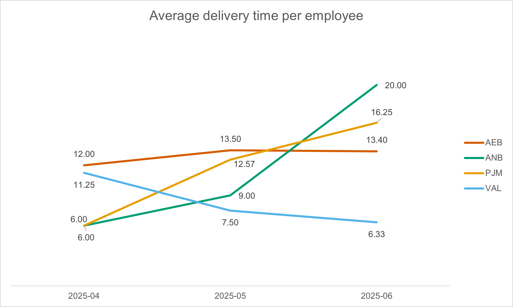
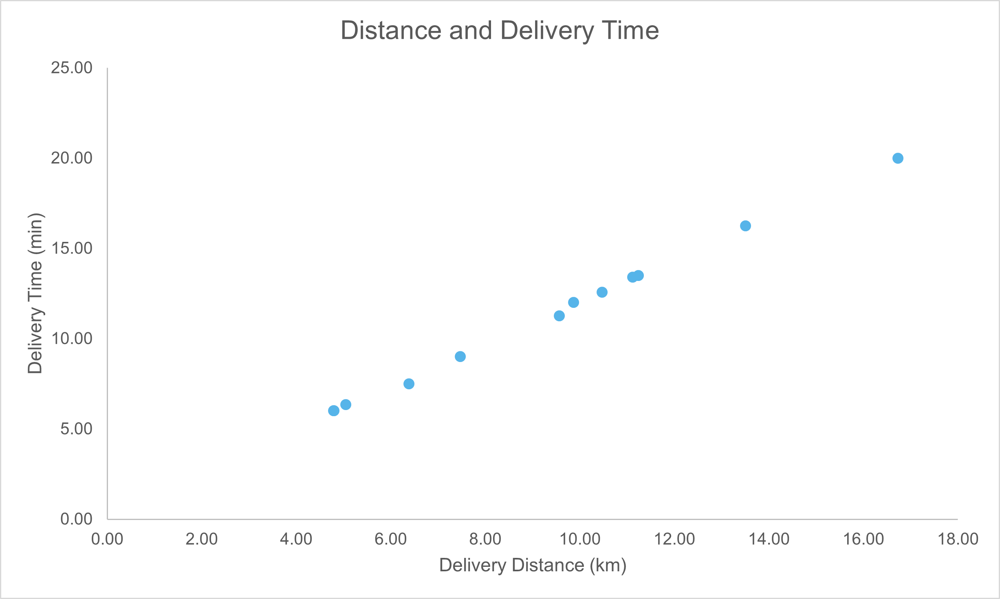
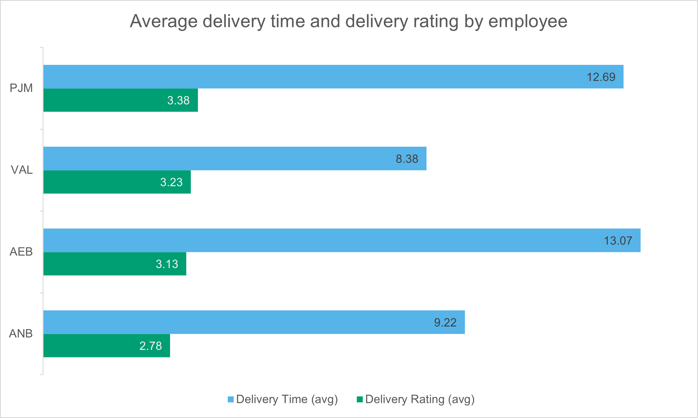
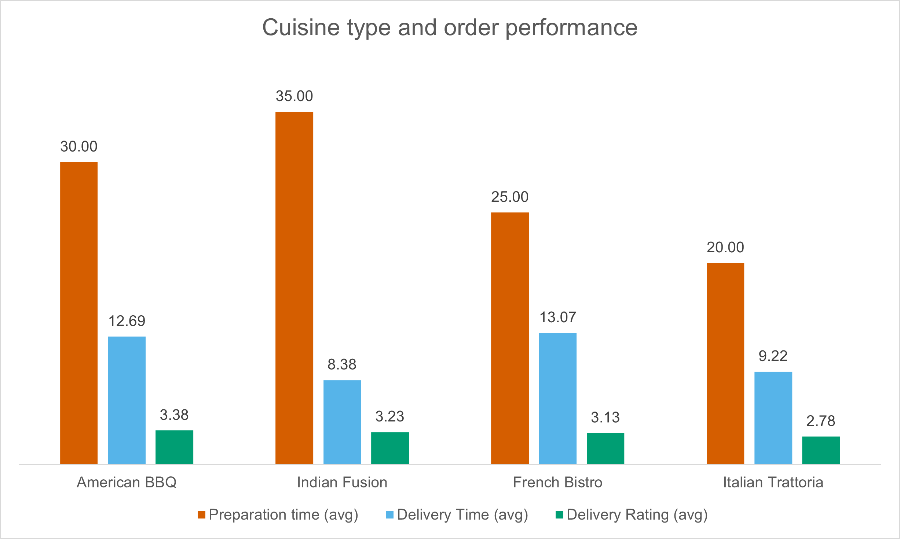
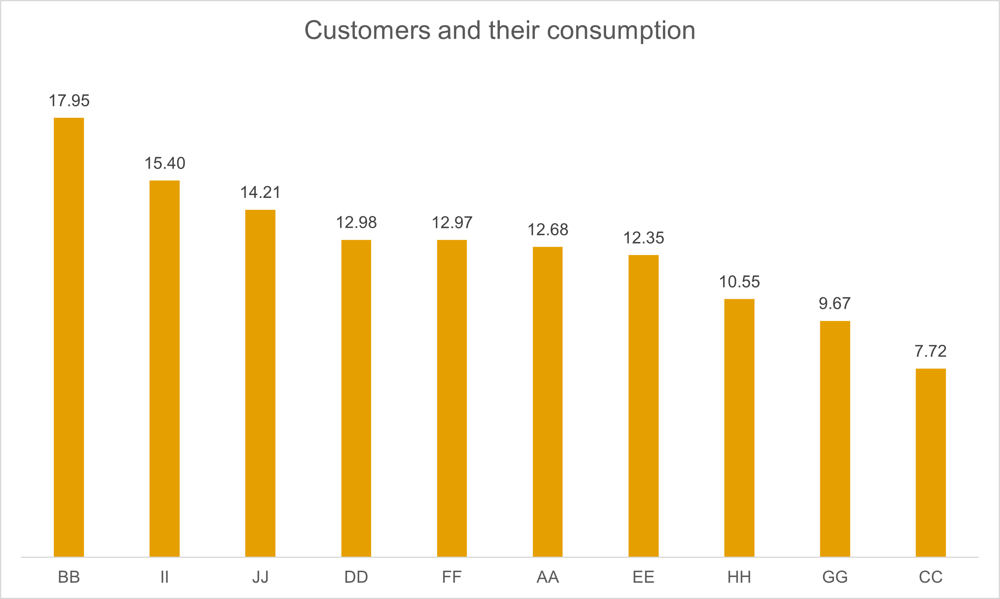

# SQL Insights

- **Trend of delivery times by employee and delivery distance:**
   ```sql
   SELECT
          d.delivery_person_id,
          STRFTIME('%Y-%m', d.order_placed_at) AS year_month,
          AVG(d.delivery_time_min) AS avg_delivery_time,
          AVG(d.delivery_distance_km) AS avg_delivery_distance
  FROM deliveries d
  GROUP BY year_month, d.delivery_person_id
  ORDER BY d.delivery_person_id;
  ```
  It has been observed that employees ANB and PJM are experiencing increased delivery times; however, the increase is significantly more pronounced for employee ANB. This suggests that the issue may need to be addressed in collaboration with ANB’s immediate coworker. It is essential to investigate the cause of this situation. Conversely, employee VAL shows a downward trend in delivery times, which may indicate changes in transportation methods or improved delivery ratings.

  
  
  <br/>
  
  As expected, a strong linear relationship exists between delivery time and distance traveled. The graph shows that these data can be fitted with a straight line, indicating a linear regression.

  

  <br/>

- **Relationship between delivery rating and delivery time by employee:**
   ```sql
  SELECT
       d.delivery_person_id,
	AVG(d.delivery_rating) AS avg_delivery_rating,
	AVG(d.delivery_time_min) AS avg_delivery_time
  FROM deliveries d
  GROUP BY d.delivery_person_id
  ORDER BY avg_delivery_rating DESC;
  ```
  The next step was to evaluate the relationship between customer satisfaction and delivery time for each employee. An interesting observation emerged: short delivery times do not always ensure positive customer ratings. This is evident in the cases of ANB and VAL. In fact, the employee with the highest delivery rating is PJM, who, despite having a relatively high average delivery time, received the best customer feedback (3.38). This could be due to other factors such as friendliness and delivery to the right place. These variables would be worth including in the analysis.

  

  <br/>

- **Cuisine Type with rating of the order and delivery time:**
  ```sql
  SELECT
       r.cuisine_type,
       AVG(d.delivery_rating) AS avg_delivery_rating,
       r.avg_preparation_time_min,
       AVG(d.delivery_time_min) AS avg_delivery_time
  FROM deliveries d
  JOIN restaurants r ON d.restaurant_area  = r.area
  GROUP BY r.cuisine_type
  ORDER BY avg_delivery_rating DESC;
  ```

  The highest-ranked food type among customers is American BBQ (3.38), while the least popular is Italian. Although American food typically takes an average of 30 minutes to prepare, customers consider it worth the wait. Surprisingly, despite Italian cuisine having the shortest preparation and delivery times, it has a relatively low rating (2.78).

  

  <br/>

- **Consumption Patterns:**
  ```sql
  SELECT
	o.customer_id,
	o.restaurant_id,
	SUM(o.order_value) AS total_order_value,
	SUM(o.items_count) AS items_order,
    SUM(o.order_value) / SUM(o.items_count) AS order_value_per_items
  FROM orders o 
  GROUP BY o.restaurant_id, o.customer_id
  ORDER BY o.customer_id, o.restaurant_id;
  ```
  This chart may appear simple, but it contains valuable information. It shows which customers have spent the most based on their total order value and the number of items ordered. This data can serve as a foundation for developing targeted marketing campaigns tailored to different customer groups and their preferred types of cuisine. For instance, customer BB, who is the highest spender (17.95), tends to favor French Bistro cuisine. The company can promote this specific type of food within the app for customers like him, ultimately increasing app usage, which is the primary goal.

  

  <br/>

  | customer_id | restaurant_id | cuisine_type   | total_order_value | items_order | order_value_per_items |
  |-------------|---------------|----------------|-------------------|-------------|-----------------------|
  | BB          | R1            | French Bistro  | 19.95             | 1           | 19.95                 |
  | BB          | R2            | American BBQ   | 33.91             | 2           | 16.955                |